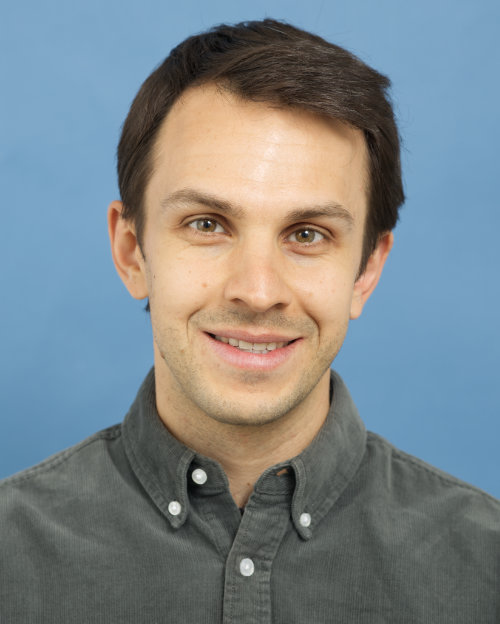
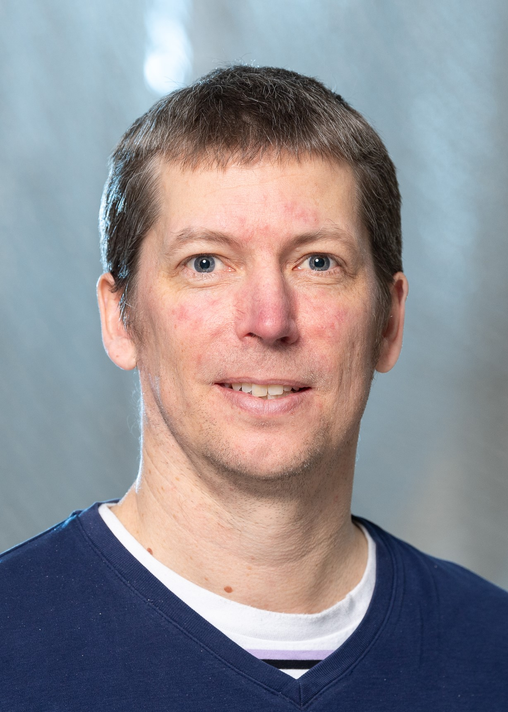

If you have any questions, do not hesitate to contact the local organizers at [msmr@psychologie.uzh.ch](mailto:msmr@psychologie.uzh.ch).

::: {layout-ncol=3}

{height=200px fig-align="left"}

{height=200px fig-align="left"}

{height=200px fig-align="left"}

:::

## Sponsors {.unnumbered .unlisted}

::: {layout-ncol=2}

 of the University of Zurich](../assets/CRS_Logo.png){height=70px fig-align="center"}

 ](../assets/SNF_Logo.png){height=70px fig-align="center"} 

:::
