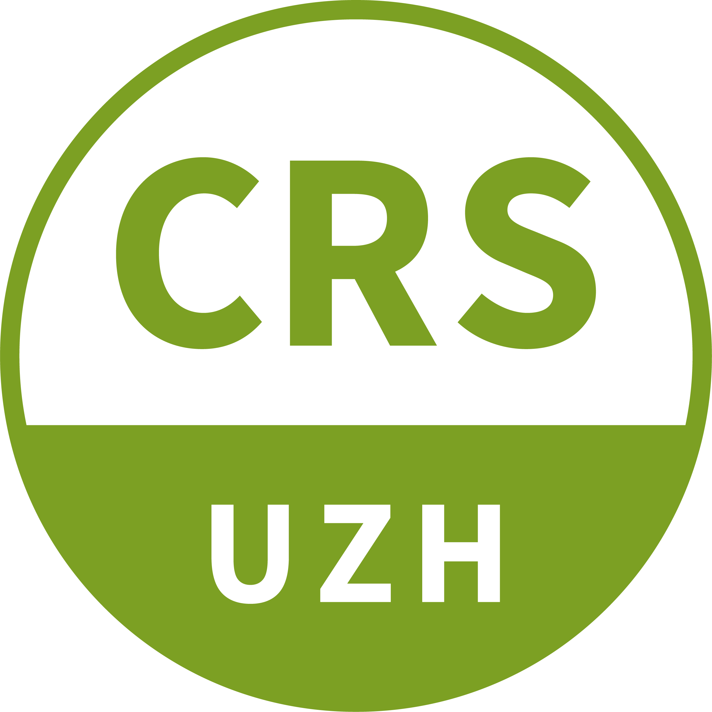
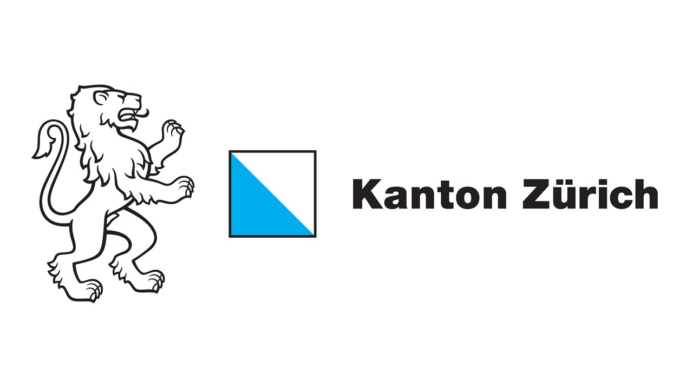

# Contact {.unnumbered .unlisted}

If you have any questions, do not hesitate to contact the local organizers at [msmr@psychologie.uzh.ch](mailto:msmr@psychologie.uzh.ch).

::: {layout-ncol=3}

{height=200px fig-align="left"}

{height=200px fig-align="left"}

{height=200px fig-align="left"}

:::

## Sponsors {.unnumbered .unlisted}

::: {layout-ncol=2}

:::

 

::: {layout-ncol=2}

:::

 

::: {layout-ncol=2}

Hochschulstiftung Universität Zürich

:::
